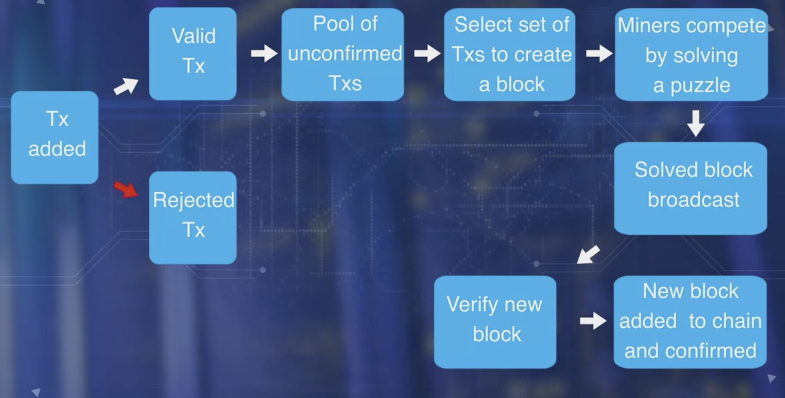

# BlockChain

- What is it → Decentralised peer to peer system.
- A collective trust model: Validation, verfication, Recording and concensus leading to trust and security.
- Blockchain is a Single consistent chain of fluxa distrubuted immutable ledger of records

What a block in a blockchain contains?

- Header
- Transactions

- Blocks go through consensus process to select the next block to be added to the chain. - Carried out by special nodes: Miners.

How is a transaction made and what it contains?

- UTXO: Unspent Transaction Output - A concept of Bitcoin network.
- Since UTXOs can only be spent once, it is not possible to double-spend digital assets. Stored in the participant nodes in a database.
- UTXOs Contain:
    - Unique identifier of the transaction that created the UTXO.
    - Index of this UTXO in the transaction's output list.
    - Value/amount.
    - (Optional Script) → conditions under which output can be spent.

- Transactino (Tx) contains:
    - Ref number of current transaction
    - Ref number(s) to one or more input UTXOs.
    - Ref number(s) to one or more output UTXOs newly generated by the transaction.
    - Total input amount and output amount.
- Transaction 0 in every block
    - Is for Paying the minor fees.
    - Doesn’t have any input UTXO
    - Is called as ‘Coinbase transaction’
- ‘Transaction confirmation’ is independently performed by all minor nodes.
- Miners, take on added work or computation to verify transactions, broadcast transactions, compete to claim the right to create a block, work on reaching consensus by validating the block, broadcasting the newly created block and confirming transactions.

Basic operations on a Decentralised network

- Role of every node in a blockchain is to carry out the following Basic operations.
    - Validation of transactions
    - Gathering transactions for a block.
    - Broadcasting valid transactions & blocks
    - Consensus on next block creation
    - Chaining of blocks

Miners and their roles

- These are additional participants that are incentivised with Bitcoin for their efforts to manage Blockchain.
- Roles:
    - Veryfying Transactions
    - Broadcast transactions
    - Compete to create a block
    - Work on reaching consensus by Validating a block
    - Broadcasting a newly created Block
    - Confirming Transactions

Validation of a Blockchain involves more than 20 Criteria.

- Referenced input & Output UTXOs
- Referenced input amount and output amount match

<!-- I have to fix the image -->

- Bitcoin’s special feature: “Scripts for Conditional transfer of values”
- Etherium extended the above to ‘Smart contract’

Types of Blockchain

1. Only Crypto-currency - Bitcoin
2. Currency + Business Logic - Etherium
3. Only Business Logic - Hyperledger

Categories of Blockchain

- Public - Bitcoin
    - Anybody can join and leave as they wish.
    - Transaction blocks and Blockchain are publicly observable but participants are anonymous.
    - Open Source
- Private
    - Access to the Blockchain is limited to selected participants.
- Permissioned/Consortium Blockchain
    - For ease of Governance, Provinance and Accountability

Smart Contracts

- it is a piece of code deployed in the blockchain node.
- allows for the execution of code in the Ethereum Blockchain, while enhancing the basic value transfer capability of the Bitcoin Blockchain.
- Its execution is initiated by a message embedded in a Smart Contract - it incurs fees for execution.
- Resembles a Class definiton, like in an OOP.
- Solidity is one of the language for Smart Contract programming

<!-- Image need to fix as per hosting platform-->

- Smart Contract in High Level language → Compiled to Byte Code → Code is executed on Every Etherium node with EVM

Types of Accounts for Smart Contract

- Accounts are basic units of Etherium protocol.
1. Externally owned Accounts/EOA → Controlled by Private keys
2. Contract Accounts/ CA → Controlled by Code & activated only by EOA
- Contract Accounts - both the below charges a fee in ‘Wei’
    - The Participant node can send transaction for Ether transfer
    - It can send transaction to invoke a smart contract.
- 1 Ether =  $10^{18}$  Wei

What a transaction in Etherium includes?

&rightarrow; Not only the fields of what transfer of Ethers but also messages for invoking a Smart Contract.

- Recipient of the message
- Digital Signature of the sender authorising the transfer
- Amount of Wei
- (Optional) Data field or a payload that contains a message to a contract
- STARTGAS (#contains max num of computation steps allowed)
- GASPRICE (#fee sender is willing to pay for the computations)

Blockstructure of Etherium

- Header
- Transactions
- Runner-Up headers

<!-- Image need to fix as per the hosting platform -->

